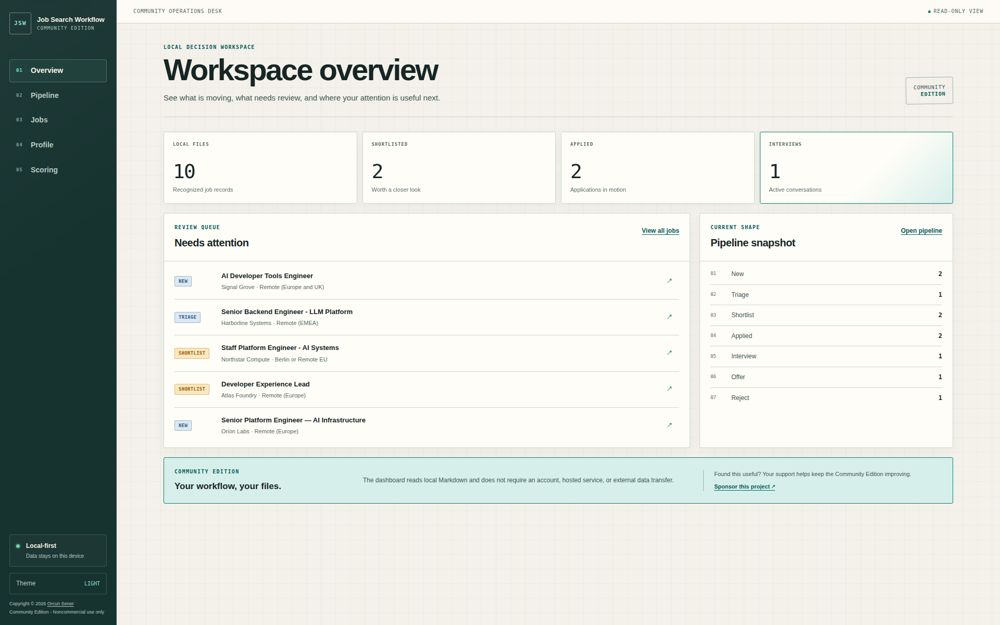

# Job Search Workflow Community Edition

> Status: Alpha. The Community Edition is cloneable and locally testable, but
> interfaces may still change before a stable release.
>
> License: source-available for noncommercial use under PolyForm Noncommercial
> 1.0.0. Commercial use is not granted by this repository. See
> [Commercial Use and SaaS Boundary](COMMERCIAL_USE.md).

See the [Changelog](CHANGELOG.md) for the current release notes.
Report vulnerabilities through the private-first process in
[Security Policy](SECURITY.md).

Job Search Workflow Community Edition is a reusable, local-first framework for
job triage, document-generation standards, application tracking, and public
job-source discovery. It ships with fictitious fixtures and uses data supplied
by each user; it does not require a hosted account.

## Quick Start

1. Clone the Community Edition repository:

   ```bash
   git clone https://github.com/rcnsnr/job-search-workflow.git
   cd job-search-workflow
   ```

2. Check the prerequisites first:

   - Linux/macOS: `./scripts/setup.sh --check-only`
   - Windows CMD: `scripts\setup.bat --check-only`

3. Run the setup:

   - Linux/macOS: `./scripts/setup.sh`
   - Windows CMD: `scripts\setup.bat`

4. Replace the generated sample files under `user_data/` with your own verified
   information. Fictitious examples remain available under `fixtures/`.

5. Follow the [30-Minute Quickstart](docs/getting-started/QUICKSTART-30MIN.md)
   to complete one first triage. Before sharing personal material with an AI
   assistant, read the [AI Assistant Integration Guide](docs/getting-started/AI-ASSISTANT-INTEGRATION.md).

Read the [Setup and Verification Guide](docs/setup-and-verification.md) for the detailed behavior contract, support matrix and troubleshooting steps.

## Documentation Map

| Need | Guide |
| --- | --- |
| First triage in one sitting | [30-Minute Quickstart](docs/getting-started/QUICKSTART-30MIN.md) |
| First end-to-end workflow | [Getting Started](docs/getting-started/GETTING_STARTED.md) |
| Use an AI assistant safely | [AI Assistant Integration Guide](docs/getting-started/AI-ASSISTANT-INTEGRATION.md) |
| Setup and supported environments | [Setup and Verification](docs/setup-and-verification.md) |
| Read-only record checks | [Workflow Guards](docs/getting-started/WORKFLOW_GUARDS.md) |
| Public job-source discovery | [Source Discovery Operations](docs/runbooks/source-discovery-operations.md) |
| Browser extension install | [Extension Install](docs/runbooks/browser-extension-install.md) |
| Local capture server | [Capture Server Setup](docs/runbooks/capture-server-setup.md) |
| Vulnerability reporting | [Security Policy](SECURITY.md) |
| License and SaaS boundary | [Commercial Use](COMMERCIAL_USE.md) |
| Project changes | [Changelog](CHANGELOG.md) |

Use the [Workflow Guards](docs/getting-started/WORKFLOW_GUARDS.md) to check
duplicates, application field limits, lifecycle metadata, and configurable
location or sponsorship eligibility without creating automatic actions.

For source discovery, see the [Public Job Sources Quickstart](docs/sources/public-job-sources.md), the
[Source Discovery Query Pack](docs/sources/source-discovery-query-pack.md), and
[Source Discovery Operations](docs/runbooks/source-discovery-operations.md).

## Requirements

Required:

- Git
- Python 3.10+
- Node.js 22.12+
- npm

Optional:

- `pandoc` - DOCX export
- `pdflatex` - PDF export
- `markdownlint-cli2` - local Markdown checks
- `shellcheck` - Bash static analysis

The setup scripts do not install missing system packages automatically and do not request administrator privileges.

## Directory Structure

- `user_data/` - local, user-specific career data
- `inbox/jobs/` - raw job-posting captures
- `runs/` - disposable analyses
- `outputs/` - cleaned, reusable outputs
- `exports/` - final application documents
- `modes/` - task-specific operating modes (job triage, source discovery, etc.)
- `scripts/` - setup and verification tools
- `tests/` - behavior tests
- `docs/` - usage and operations guides
- `docs/sources/` - public-safe source discovery quickstart and example catalog
- `docs/runbooks/` - repeatable operational procedures
- `tools/browser-extension/` - `Job Search Workflow Capture` browser extension source
- `fixtures/` - fictitious sample data for local demos and tests
- `templates/` - starter files to copy into your Git-ignored local `user_data/` workspace
- `dashboard/` - local Community Operations Desk interface

## Advanced: Browser Extension

The `Job Search Workflow Capture` browser extension captures job postings from
LinkedIn Jobs and exports them as Job Search Workflow Markdown/JSONL, CSV, or JSON. It can
also send postings to a local FastAPI capture server that writes directly to
`inbox/jobs/` for unattended workflows.

- Install: `docs/runbooks/browser-extension-install.md`
- Capture server setup: `docs/runbooks/capture-server-setup.md`
- Integration contract: `docs/integration/job-search-workflow.md`
- Extension source: `tools/browser-extension/`

Extension validation:

```bash
cd tools/browser-extension
npm ci
npm test
npm run lint
node scripts/validate-manifest.js
```

## Community Operations Desk

The local dashboard is the primary visual surface for Job Search Workflow
Community Edition. It reads Markdown from `inbox/jobs/` and falls back to
fictitious fixtures when no personal workspace exists.



```bash
pip install -e ".[dashboard]"
python3 -m jsw dashboard
```

Open `http://localhost:3000` to use:

- a local workspace overview and attention list
- a responsive application pipeline
- searchable job records with compact dates
- posting-specific CV, cover-letter, and application-answer access
- profile, career-direction, decision-criteria, and scoring reference views
- a light-first interface with an optional dark theme

The dashboard is read-only and does not require an account or external data
transfer. `scripts/job_dashboard.py` is retained as a legacy compatibility
entry point; `python3 -m jsw dashboard` is the canonical interface.

The public preview uses five stable fixture screenshots. They are refreshed at
the same paths whenever dashboard visuals change; see the
[Dashboard Screenshot Baseline](docs/runbooks/dashboard-screenshot-baseline.md).

To surface application documents for a job, place them under
`exports/applications/<posting-filename-without-.md>/`. The dashboard admits
only CV/resume, cover-letter, and application-answer files with `.md`, `.txt`,
`.pdf`, or `.docx` extensions. LaTeX sources, triage notes, research, and other
preparation files are intentionally excluded.

## Verification

From the public repository root on Linux or macOS:

```bash
bash -n scripts/setup.sh
shellcheck scripts/setup.sh
python3 -m pip install -e ".[dashboard,dev]"
python3 -m pytest -q
PYTHONPATH=scripts python3 -m jsw smoke
python3 scripts/scan_pii.py --path .
python3 scripts/check_secret_hygiene.py
python3 scripts/check_license_policy.py
markdownlint-cli2 "**/*.md"
./scripts/setup.sh
```

Pull-request CI runs Python, dashboard, privacy, documentation, and extension
checks. The scheduled Setup Audit runs Linux and real Windows CMD setup jobs;
Windows support is not considered verified unless that job passes.

## Security and Privacy

- Content under `user_data/`, `inbox/jobs/`, `runs/`, `outputs/` and `exports/` is excluded by `.gitignore`.
- `.gitignore` alone does not guarantee prevention of personal-data leaks.
- The framework does not send your files to an AI provider. If you paste or
  upload content to an AI assistant, that selected content is handled by that
  provider under its own terms. Use the [AI Assistant Integration Guide](docs/getting-started/AI-ASSISTANT-INTEGRATION.md)
  to choose a narrow sharing path.
- Before every public contribution or release, run deterministic PII and secret
  scans, perform a manual content review, verify licensing, and confirm that
  Git history contains no unintended private data.
- This framework does not guarantee employment, interviews or offers.

See `.github/workflows/ci.yml` for pull-request checks. Scheduled setup,
career-page, and clone scans are intentionally separate operational workflows.
